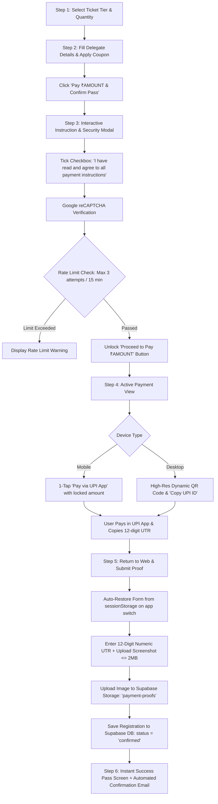

# TEDxGCEM — Direct UPI Payment Architecture & Specification

> **Status:** Production Specification / Architecture Blueprint  
> **Version:** 1.0.0  
> **Target Framework:** Next.js 15+ (App Router), TypeScript, Tailwind CSS, Supabase  
> **Purpose:** Comprehensive implementation guide for transitioning from Razorpay Gateway to an Enterprise-Grade, Zero-Fee Direct UPI QR & Deep Link Payment Flow with instant ticket confirmation.

---

## 1. Executive Summary & Core Objectives

### The Problem
Traditional payment gateways (such as Razorpay) levy a 2%–3% transaction surcharge per ticket, enforce 48–72 hour settlement delays, and require extensive merchant KYC. 

### The Solution
A **Zero-Fee Direct UPI Architecture** where:
1. Attendees pay directly from their UPI app (Google Pay, PhonePe, Paytm, BHIM) to the organizer's bank account.
2. The payment app opens with the **receiver account and calculated ticket amount pre-filled and locked** via NPCI standards.
3. Users submit proof (payment screenshot $\le$ 2 MB + 12-digit bank UTR reference).
4. Tickets are **confirmed instantly** with an official pass and automated confirmation email (no manual team verification required to issue the pass).
5. The system includes **enterprise-grade state preservation**, **Google reCAPTCHA**, **rate limiting (max 3 attempts per 15 minutes)**, and **foolproof app-switching resilience**.

---

## 2. Unchanged Core Elements (Strict Parity)

The following components and business rules remain **100% untouched and identical**:

* **Ticket Tiers & Pricing:** Loaded dynamically from Supabase (`ticket_tiers` table) with local fallback (`DEFAULT_TICKET_TIERS` in `src/lib/ticket-service.ts`).
* **Early Bird Pass Rules:**
  - `allow_coupons: false`
  - Any attempt to apply promo coupons to Early Bird passes is strictly rejected with:  
    `"Promo codes cannot be applied to Early Bird passes as they are already pre-discounted."`
* **Phase 1 / Phase 2 Passes:**
  - `allow_coupons: true`
  - Coupons are validated server-side via `validateCoupon()` in `src/lib/coupon-service.ts`.
  - Discounted prices are calculated dynamically.
* **Attendee Registration Form (Screen 2):**
  - Primary delegate fields: Full Name, Email, Phone Number, Role/Designation, College/University.
  - Multi-ticket quantity support (Pass #1, Pass #2, etc.).
* **Trigger Action:**
  - The form button: `Pay ₹[AMOUNT] & Confirm [X] Pass(es)`.

---

## 3. End-to-End User Journey & State Machine



---

## 4. Detailed Step-by-Step Flow Specification

### Step 1 & 2: Ticket Selection & Details
* The user selects an active ticket tier and fills in all required fields.
* Form data is continuously persisted in `sessionStorage` (`tedx_registration_draft`) on every input change to protect against memory purge when low-RAM mobile devices switch between browser and payment apps.

### Step 3: Interactive Instruction & Security Modal
When clicking `Pay ₹[AMOUNT] & Confirm [X] Pass(es)`, a high-impact, full-screen glassmorphic modal opens:
* **Header:** TEDxGCEM Official Payment Instructions with dynamic payable amount banner.
* **5 Golden Rules:**
  1. **Direct UPI Redirection:** Mobile users will launch Google Pay, PhonePe, or Paytm directly. Desktop users can scan the QR code.
  2. **Locked Amount:** Pay the exact amount shown. Do not modify or alter the amount.
  3. **Screenshot Receipt:** Take a clear screenshot of the green "Payment Successful" screen immediately.
  4. **Record UTR:** Note down or copy the 12-digit Bank UTR / UPI Transaction reference number.
  5. **Finalize Pass:** Return to this browser tab to upload the screenshot and paste the 12-digit UTR.
* **Security & Gates:**
  - Mandatory Checkbox: `[ ] I have read and agree to all payment instructions`.
  - **Cloudflare Turnstile Widget:** Privacy-preserving, frictionless bot detection (Supabase's officially supported provider, eliminating irritating image puzzles for mobile delegates).
  - Rate limiting enforcement: Blocks more than 3 attempts within 15 minutes per IP address.
  - Action Button: `Proceed to Pay ₹[AMOUNT]` is visually disabled and greyed out until **both** checkbox is checked and Turnstile token is acquired.

### Step 4: UPI Deep Linking & Payment Execution
* **The NPCI Deep Link Protocol:**
  ```text
  upi://pay?pa={UPI_ID}&pn={UPI_NAME}&am={AMOUNT}&mam={AMOUNT}&cu=INR&tn={TRANSACTION_NOTE}
  ```
  * `pa`: Receiver UPI VPA (from `process.env.NEXT_PUBLIC_UPI_ID`)
  * `pn`: Receiver Name (from `process.env.NEXT_PUBLIC_UPI_NAME`, e.g., `TEDxGCEM 2026`)
  * `am`: Calculated ticket amount (formatted to 2 decimal places, e.g., `500.00`)
  * `mam`: Minimum acceptable amount (set equal to `am` to instruct UPI apps that the price is fixed)
  * `cu`: `INR`
  * `tn`: `TEDxGCEM Pass Registration`
* **Mobile Behavior:**
  - One-tap button: `Pay ₹[AMOUNT] via UPI App` with Google Pay, PhonePe, Paytm, and BHIM branding icons.
  - Clicking launches the system intent sheet to pick the UPI app.
* **Desktop / Laptop Behavior (Dual-Mode & Auto-Login Bridge Architecture):**
  - **The Split 2-Column Laptop Checkout Modal:**
    On laptop screens, the checkout experience uses a high-impact, full-screen glassmorphic modal with a 2-column layout:
    ```text
    ┌──────────────────────────────────────────────┬─────────────────────────────────────────┐
    │           LEFT COLUMN: INSTRUCTIONS          │          RIGHT COLUMN: LIVE QR          │
    ├──────────────────────────────────────────────┼─────────────────────────────────────────┤
    │  TEDxGCEM 2026 • Pass Checkout               │                                         │
    │  Tier: General Delegate • Total: ₹500.00     │                ┌──────────┐             │
    │                                              │                │ █▀▀▀▀▀█  │             │
    │  How to complete payment on your phone:      │                │ █ ███ █  │             │
    │                                              │                │ █▄▄▄▄▄█  │             │
    │  1. Scan with Phone Camera (Not GPay scanner)│                │ ▄▄ ▄▄ ▄▄ │             │
    │     Point your iPhone Camera or Android Lens │                │ █▀▀▀▀▀█  │             │
    │     at the QR code on the right. Tap link.   │                └──────────┘             │
    │                                              │                                         │
    │  2. Your Details & Login Are Already Saved!  │         Scan with phone camera          │
    │     The page opens on your phone with your   │         (iPhone Camera or Lens)         │
    │     Google account verified & details filled.│                                         │
    │                                              │         ⏳ Waiting for mobile...        │
    │  3. Pay via UPI & Take a Screenshot          │         Listening for confirmation      │
    │     Tap "Pay via UPI App" on your phone to   │                                         │
    │     launch Google Pay / PhonePe. Pay ₹500.   │         [ Copy Phone Link ]             │
    │                                              │                                         │
    │  4. Upload Proof & Auto-Sync                 │  ─────────────────────────────────────  │
    │     Submit screenshot & UTR on your phone.   │  Or prefer staying on laptop?           │
    │     ✨ This laptop screen will auto-refresh   │  [ Switch to Direct UPI QR Code ]       │
    │     and display your pass the instant you do!│                                         │
    └──────────────────────────────────────────────┴─────────────────────────────────────────┘
    ```
  - **The Enterprise "Auto-Login Bridge" Protocol (Method 2):**
    - The attendee is **already authenticated via Google** on the laptop.
    - When the laptop requests the handoff QR code, the server creates a `registration_drafts` record and generates a cryptographically random, one-time `auth_handoff_token` (10-minute TTL) bound to `user.id` and `user.email`.
    - The Handoff QR code encodes: `https://tedxgcem.in/register?draft_id={draftId}&auth_token={token}`.
    - When the phone camera scans the QR code:
      - The Next.js mobile route validates the `auth_handoff_token`.
      - Supabase automatically authenticates the mobile browser session under the **same Google user identity** without forcing a separate Google OAuth redirect.
      - Phone banner displays: `✓ Verified as [Name] ([email])`.
    - **Fail-Safe Fallback:** If the QR code is scanned after the 10-minute token expires:
      - The phone shows a clean, friendly modal:  
        *"Handoff token expired. Tap below to continue as [email]"* with a `[ Continue with Google ]` 1-tap button that re-attaches the draft seamlessly.

### Step 5: Enterprise App-Switching, State Resilience & Real-Time Sync
* **Real-Time Cross-Device Synchronization:**
  - The laptop screen initializes a Supabase Realtime channel listening to `draft-{draftId}`:
    ```typescript
    const channel = supabase
      .channel(`draft-${draftId}`)
      .on('postgres_changes', {
        event: 'UPDATE',
        schema: 'public',
        table: 'registration_drafts',
        filter: `id=eq.${draftId}`,
      }, (payload) => {
        if (payload.new.status === 'confirmed') {
          // 🎉 Phone completed payment! Auto-transition laptop screen to confirmed pass
          setRegistrationData(payload.new);
          setIsSuccess(true);
        }
      })
      .subscribe();
    ```
  - **Fallback Polling:** In case WebSockets are blocked by aggressive college firewalls, the laptop also polls `/api/register/draft-status?id={draftId}` every 3 seconds as a background backup.
* **Browser Visibility Detection (On Mobile):**
  ```typescript
  useEffect(() => {
    const handleVisibilityChange = () => {
      if (document.visibilityState === "visible") {
        // User returned to browser from Google Pay / PhonePe
        // Auto-focus screenshot upload and pulse the UTR field
      }
    };
    document.addEventListener("visibilitychange", handleVisibilityChange);
    return () => document.removeEventListener("visibilitychange", handleVisibilityChange);
  }, []);
  ```
* **Session & Closed-Tab Restoration (24-Hour Draft Window):**
  - **Accidental Tab Close / Browser Kill:** Form data is synchronized to `localStorage` (`tedx_registration_draft_v1`) with a 24-hour expiration timestamp. If the user accidentally closes the tab or restarts their phone, reopening the site prompts:
    > *"Welcome back [Name]! We found your in-progress registration for [Tier]. [Resume & Submit Payment Proof]"*
  - Clicking resumes directly at the Payment & Proof Submission view with all fields intact.

### Step 6: Proof Submission & Validation
* **12-Digit Numeric UTR Input:**
  - Enforced regular expression: `^\d{12}$` (exactly 12 digits, numeric only).
  - "Where do I find UTR?" modal/tooltip displaying a visual helper showing Google Pay and PhonePe receipts with the 12-digit UTR circled.
* **Screenshot Upload Validation:**
  - Allowed MIME types: `image/jpeg`, `image/png`, `image/webp`.
  - Max size: `2 * 1024 * 1024` bytes (2 MB).
  - Client-side image compression (HTML5 Canvas) automatically scales high-res phone screenshots exceeding 2 MB down to $\le$ 1.5 MB without quality degradation.
  - Live thumbnail preview with a "Change Image" option.

### Step 7: Direct Instant Confirmation
* **Direct Success (No Manual Approval Gate):**
  - Registration status is immediately set to `confirmed`.
  - Pass QR code is generated instantly.
  - Screen displays the completed **Delegate Pass** with download and print options.
  - Resend email trigger fires in the background with the pass and registration receipt.
* **Storage in Supabase:**
  - Screenshot uploaded to Supabase Storage bucket: `payment-proofs/{registration_id}_{timestamp}.webp`.
  - Record inserted/updated in Supabase `registrations` table with all fields.
  - Corresponding `registration_drafts` status updated to `confirmed`.

---

## 5. Database Schema & Supabase Configuration

### Supabase Storage Bucket
* Bucket Name: `payment-proofs`
* Public Access: Read-only for authenticated admins / signed URLs for delegates.
* Max file size limit: `2097152` (2 MB).
* Allowed MIME types: `image/png`, `image/jpeg`, `image/webp`.

### Database Tables & Schema

```sql
-- 1. Registration Drafts Table (For Cross-Device Handoff & Auto-Login)
CREATE TABLE IF NOT EXISTS public.registration_drafts (
  id text PRIMARY KEY,                                      -- e.g. "draft_8f9e2a3b"
  user_id uuid REFERENCES auth.users(id) ON DELETE CASCADE, -- Google Auth user ID
  auth_handoff_token text UNIQUE,                           -- One-time secure token (10m TTL)
  auth_token_expires_at timestamptz,                        -- Expiry timestamp for handoff token
  full_name text NOT NULL,
  email text NOT NULL,
  phone text NOT NULL,
  college text,
  designation text,
  linkedin text,
  referral text,
  tier_id text NOT NULL,
  quantity integer DEFAULT 1,
  amount numeric(10, 2) NOT NULL,
  coupon_code text,
  discount_amount numeric(10, 2) DEFAULT 0.00,
  attendees_json jsonb DEFAULT '[]'::jsonb,
  status text DEFAULT 'pending',                            -- 'pending', 'confirmed', 'expired'
  created_at timestamptz DEFAULT now(),
  expires_at timestamptz DEFAULT (now() + interval '24 hours')
);

-- Enable Supabase Realtime for instant laptop auto-sync
ALTER PUBLICATION supabase_realtime ADD TABLE public.registration_drafts;

-- 2. Final Registrations Table Updates
ALTER TABLE public.registrations 
  ADD COLUMN IF NOT EXISTS payment_method text DEFAULT 'direct_upi',
  ADD COLUMN IF NOT EXISTS utr_number varchar(12),
  ADD COLUMN IF NOT EXISTS payment_screenshot_url text,
  ADD COLUMN IF NOT EXISTS amount_paid numeric(10, 2),
  ADD COLUMN IF NOT EXISTS coupon_applied text,
  ADD COLUMN IF NOT EXISTS discount_amount numeric(10, 2) DEFAULT 0.00;

-- Prevent duplicate submissions with the same UTR number (Strict uniqueness)
CREATE UNIQUE INDEX IF NOT EXISTS idx_registrations_utr_number 
  ON public.registrations(utr_number) 
  WHERE utr_number IS NOT NULL AND utr_number != '';
```

---

## 6. Security & Rate Limiting Architecture

### 1. Cloudflare Turnstile Verification (Supabase Native Bot Detection & Server Verification)
* **Supabase Native Integration:** Configured directly in Supabase Dashboard (**Authentication → Attack Protection → Turnstile**) for auth security.
* **Server-Side Verification for Registration Forms:**
  - Client acquires `turnstile_token` from `<Turnstile />` component and submits with registration payload.
  - Next.js server route / Server Action validates token with Cloudflare before writing to Supabase:
  ```typescript
  const verifyRes = await fetch("https://challenges.cloudflare.com/turnstile/v0/siteverify", {
    method: "POST",
    headers: { "Content-Type": "application/json" },
    body: JSON.stringify({
      secret: process.env.TURNSTILE_SECRET_KEY,
      response: turnstileToken,
    }),
  });
  const outcome = await verifyRes.json();
  if (!outcome.success) {
    return NextResponse.json({ error: "Bot detection check failed. Please refresh and try again." }, { status: 400 });
  }
  ```

### 2. IP Rate Limiting (3 Attempts per 15 Minutes)
* Prevents spam submissions and brute-force testing of UTR numbers.
* Implemented via sliding-window cache in `src/lib/rate-limiter.ts` using client IP from headers (`x-forwarded-for` or `cf-connecting-ip`).
* If attempts $> 3$ within $15 \times 60 \times 1000\text{ ms}$, reject with HTTP 429:
  `"Too many payment attempts. Please wait 15 minutes before trying again."`

---

## 7. Enterprise Resilience & Zero-Failure Engineering Matrix

To ensure true enterprise-grade quality with **zero runtime crashes, zero lost data, and zero security loopholes**, the implementation must strictly comply with the following standards:

| Threat / Edge Case | Failure Mode in Weak Systems | Enterprise Safeguard in This Architecture |
| :--- | :--- | :--- |
| **Duplicate / Repeated Submissions** | Attendee rapidly double-clicks "Submit" or network retries duplicate pass creation. | **Idempotency Gate:** Immediate client-side button lock (`isSubmitting`) + Server-side transaction check: If `utr_number` or `draft_id` is already confirmed, return existing pass immediately without re-inserting or double-emailing. |
| **Cross-Device Account Mismatch** | Attendee logged in as User A on laptop, but phone opens as User B. | **Auto-Login Bridge:** Handoff token securely binds the mobile session to the exact `user_id` authenticated on the laptop. Mismatched accounts are rejected. |
| **Token Expiration on Mobile** | User opens QR code 15 minutes later after token TTL. | **Graceful Fallback:** Displays 1-click Google OAuth prompt with pre-filled email to re-verify identity and resume the active draft. |
| **Incognito / Private Mode** | `localStorage` throws `QuotaExceededError` in Safari Private Browsing, crashing the page. | All storage reads/writes are wrapped in a resilient `SafeStorage` wrapper with an in-memory fallback. Zero crashes. |
| **Flaky 4G / Network Drop** | Screenshot upload hangs indefinitely or fails halfway. | Automatic 3-attempt exponential backoff retry on upload with animated progress indicator. |
| **Fake File Extension** | Attacker renames an `.exe` or `.sh` script to `.png` and uploads it. | Server-side MIME validation and file header (magic bytes) verification before accepting storage upload. |
| **XSS / Input Injection** | Attacker injects `<script>` tags in attendee name or college fields. | Strict server-side Zod validation and HTML sanitization on all text fields prior to Supabase DB upsert. |
| **Orphaned Storage Blobs** | Image uploads to storage, but database insert fails due to network drop. | Server-side transaction compensation: If DB insertion fails, the uploaded storage file is purged immediately. |
| **Zero-Amount / Price Tampering** | Attacker attempts to modify the ticket amount in client DOM. | The final payable amount is re-calculated and verified server-side against active Supabase ticket tiers and coupon tables. Client values are never blindly trusted. |

---

## 8. Environment Variables Required

Add to `.env.local`:

```env
# ===================================================
# DIRECT UPI PAYMENT CONFIGURATION
# ===================================================
NEXT_PUBLIC_UPI_ID="tedxgcem@okhdfcbank"
NEXT_PUBLIC_UPI_NAME="TEDxGCEM 2026"

# ===================================================
# CLOUDFLARE TURNSTILE (Supabase-Native Bot Protection)
# ===================================================
NEXT_PUBLIC_TURNSTILE_SITE_KEY="0x4AAAAAA..."
TURNSTILE_SECRET_KEY="0x4AAAAAA..."

# ===================================================
# SUPABASE CONFIGURATION (Storage & DB)
# ===================================================
SUPABASE_URL="https://your-project.supabase.co"
SUPABASE_ANON_KEY="your-anon-key"
SUPABASE_SERVICE_ROLE_KEY="your-service-role-key"

# ===================================================
# RESEND EMAIL CONFIGURATION
# ===================================================
RESEND_API_KEY="your-resend-key"
RESEND_FROME_MAIL="team@tedxgcem.in"
NEXT_PUBLIC_SITE_URL="https://tedxgcem.in"
```

---

## 9. Target File Structure for Implementation

When ready to implement, the code changes map to:

* `src/components/sections/RegisterNow.tsx`:
  - Replace Razorpay popup handler with the **Instruction & Security Modal**.
  - Add UPI deep linking trigger and QR viewer.
  - Add Screenshot Upload & UTR input section.
  - Implement `sessionStorage` draft saving & `visibilitychange` listeners.
* `src/components/ui/UpiInstructionModal.tsx`:
  - Dedicated full-screen modal component with the 5 steps, checkbox, and Cloudflare Turnstile.
* `src/components/ui/UtrHelpModal.tsx`:
  - Visual graphic explaining where to find the 12-digit UTR in GPay, PhonePe, and Paytm.
* `src/app/api/register/upi-submit/route.ts`:
  - Handles Cloudflare Turnstile verification, rate limiting, Supabase storage upload, database registration insertion (`status = 'confirmed'`), and Resend email dispatch.
* `src/lib/rate-limiter.ts`:
  - Memory or Redis-backed sliding-window rate limiter (3 attempts / 15 min).
* `src/components/sections/AdminConsole.tsx`:
  - Display UTR column and a button to preview the uploaded payment screenshot for audit records.

---

## 10. Implementation Checklist (For Future AI / Developer)

- [ ] Create and switch to new branch `feat/upi-qr-payment`.
- [ ] Add `payment-proofs` bucket to Supabase Storage with 2 MB size limits.
- [ ] Run migration for `utr_number`, `payment_screenshot_url`, and unique UTR index.
- [ ] Add environment variables to `.env.local`.
- [ ] Implement rate-limiter utility (`src/lib/rate-limiter.ts`).
- [ ] Integrate Cloudflare Turnstile in `RegisterNow.tsx`.
- [ ] Build `UpiInstructionModal.tsx` with 5 steps and checkbox gate.
- [ ] Build UTR & screenshot upload form with client-side compression ($\le$ 2 MB).
- [ ] Implement direct confirmation state & email delivery via Resend.
- [ ] Add screenshot preview and UTR column in `AdminConsole.tsx`.
